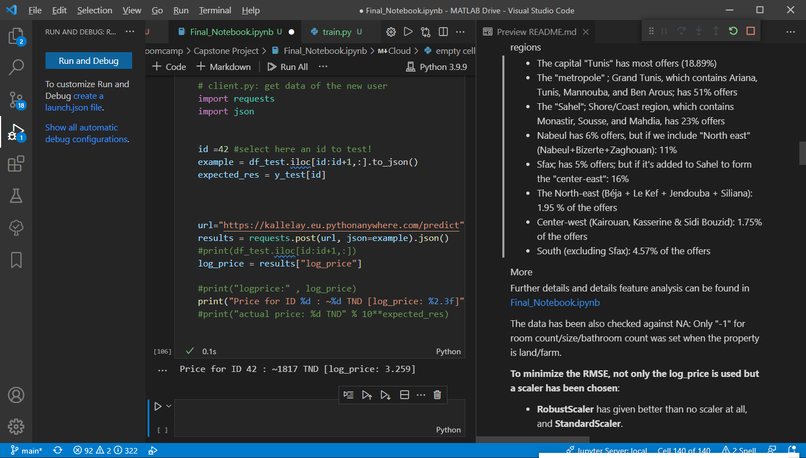

 # Documentation of Capstone project: Prediction of Property Prices in Tunisia
by *Ahmed Yahia Kallel* for ML Zoomcamp.

 ---
 ### Academic honor code
 * _This work is original and is conducted individually. It has not been fully or partly copied with or without changes from any other place aside from the material from ML Zoomcamp. Any resemblance to other works is purely coincidental._
* _The final results are not very impressive. The work is done purely to demonstrate my capability to work with a database, clean it, analyze it, use different models with tuning, then deploy the model for prediction in local/local cloud/public cloud. Possible improvements could be to use other algorithms for a better classification. However, the guidelines say that it is sufficient to train and tune the models discussed in the courses (decision trees and linear models), which have been fulfilled during this work._

* Disclaimer: this readme borrows several installation clarification from my "midterm project" for the installation and configuration guide. No other parts or code are copied, excepting the typical routines (libraries import & data splitting). 
---


## Part 1: On the database, features analysis and model selection

 ### Introduction
**Tunisia** is a north African country known for its beaches, olive oil, and Mediterranean cuisine. Since the revolution 11 years ago, the prices of properties (houses, lands, farms) have gone a drastic change. Furthermore, many "chance-hunters" from real estates are scamming people by overpricing the properties.

It is a common sense that properties in capital and big cities have higher price, which is one of the criteria that decide the price. In fact, it is also given the number of rooms in flats, or the size of the property are also among the key metric for the price, not to mention if the offer is for sale or for rent.

Therefore, in this project, and based on the database, I try to deliver the price prediction given certain parameters such as the type of accommodation/property (land/house/office/farm), the approximate location (region/city), number of rooms, and size.

For this, I propose to implement a regression-based algorithm, which, when given specific parameters about the desired property (number of rooms, size, rent/sale, approximate location), predicts the approximate price of the property. The database I used is documented in the next section


 ### Database Description
This database [Property Prices in Tunisia.csv](Property Prices in Tunisia.csv) is retrieved from [https://www.kaggle.com/ghassen1302/property-prices-in-tunisia](https://www.kaggle.com/ghassen1302/property-prices-in-tunisia), which is made by Ghassen Chaabouni, based on information from tayara.tn, a local website that offers these properties.

The database is english-french, and I have translated the keywords to english using DeepL, Google Translate, to which I personally ensured the quality. It contains 12748 rows/records, and 9 columns/features: *category, room_count, bathroom_count, type, size, price, city, region, log_price*. 

* Category [**categorical**]: type of property (house, flat, shop, business premises, farm)
      *['Land and Farms', 'Apartments', 'Holiday rentals',
       'Shops, Businesses and Industrial Premises', 'Houses and Villas', 'Flatshare', 'Offices and Trays']*
* room_count [**numerical**]: number of room (if applicable)
* bathroom_count [**numerical**]: number of bathrooms (if applicable)
* type [**categorical**]: for renting or for sale
* size [**numerical**]: the size of the property in m²
* price [**numerical**]: price of the property
* city [**categorical**]: the city where the property is located
* region [**categorical**]: the region from the city, where the property is located
* log_price [**numerical**]: the decimal log of the price


 ### Database Analysis
First analysis shows that the database contains **12748 property records**

#### category

|   | Category                                  | Share in %|   |
|---|-------------------------------------------|-----------|---|
|   | Apartments                                | 36.868528 |   |
|   | Flatshare                                 | 0.509884  |   |
|   | Holiday rentals                           | 2.337622  |   |
|   | Houses and Villas                         | 24.772513 |   |
|   | Land and Farms                            | 26.788516 |   |
|   | Offices and Trays                         | 3.616254  |   |
|   | Shops, Businesses and Industrial Premises | 5.106683  |   |

#### Type
|   Type    |   |   |   | Share in %|
|-----------|---|---|---|-----------|
| For  rent |   |   |   | 39.143395 |
| For  sale |   |   |   | 60.856605 |

#### regions
* The capital "Tunis" has most offers (18.89%)
* The "metropole" ; Grand Tunis, which contains Ariana, Tunis, Mannouba, and Ben Arous; has 51% offers
* The "Sahel"; Shore/Coast region, which contains Monastir, Sousse, and Mahdia, has 23% offers
* Nabeul has 6% offers, but if we include "North east" (Nabeul+Bizerte+Zaghouan): 11%
* Sfax; has 5% offers; but if it's added to Sahel to form the "center-east": 16%
* The North-east (Béja + Le Kef + Jendouba + Siliana): 1.95 % of the offers
* Center-west (Kairouan, Kasserine & Sidi Bouzid): 1.75% of the offers
* South (excluding Sfax): 4.57% of the offers


#### More
Further details and details feature analysis can be found in  [Final_Notebook.ipynb](Final_Notebook.ipynb) 

The data has been also checked against NA: Only "-1" for room count/size/bathroom count was set when the property is land/farm.

**To minimize the RMSE, not only the log_price is used but a scaler has been chosen**:
- **RobustScaler** has given better than no scaler at all, and **StandardScaler**.


 ### Data preparation and model selection and tuning

 #### Implementation Details
 The database is split into 60% for training, 20% for validation, and 20% for testing using random_state=1.

 The correlation results show that bathroom count and room count are correlated with a coefficient of 80%. The other features are less correlated. Feature correlation and importance analysis are done in [Final_Notebook.ipynb](Final_Notebook.ipynb). 

 In this project, I have tried seven different classifiers:
 * linear regressor
* support vector regressor
* decision tree regressor
* random forest regressor
* elasticNet regressor
* gradient booster regressor
* xgboost 

For each regressor, a test run with the default parameters is done, followed by a trial-and-error combination of parameters. All the regressors have been tuned based on the best most performing tuned parameters. 

Since the project is a regression theory-based solution, Root Mean Square Error (RMSE), is used as a metric to evaluate both of the regression training score, and the validation score.

  <br/>
  
#### Results
Below are the RMSE obtained following regression.

|| LinearRegression-default | SVR-default | SVR-C0.9eps0.15 | DT-default | DT-maxdep3 | RF-default | RF-madep5nest34 | RF-madep2nest89 | RF-madep5nest31 | EN-default | EN-a0.04lone0.05 | GB-default | GB-lr003nest1000 |          
|-------------------------:|------------:|----------------:|-----------:|-----------:|-----------:|----------------:|----------------:|----------------:|-----------:|-----------------:|-----------:|-----------------:|----------|
|                    train |    0.522273 |        0.502043 |   0.502613 |   0.344086 |   0.562987 |        0.372921 |        0.528873 |        0.573620 |   0.529143 |         1.293389 |   0.537431 |         0.511446 | 0.494942 |
|                      val |    0.559898 |        0.545259 |   0.545021 |   0.655376 |   0.564742 |        0.564084 |        0.557415 |        0.574794 |   0.558589 |         1.277913 |   0.548775 |         0.544403 | 0.544177 |


```GradientBoostingRegressor(max_depth=1000,learning_rate=0.03)``` was selected as a final regressor, as it provides least RMSE validation score.


  <br/>

  
 #### Neural-Network Regressors:
 [Final_Notebook_Part2.ipynb](Final_Notebook_Part2.ipynb) contains a continuation of the regression testruns but using Neural Networks (based on Keras). Here several configurations, optimizers, number of neurons were tested and tuned. However, most of the results remain behind the results of GradientBoostingRegressor.
  

  <br/>

#### Ensemble Regressors:
[Final_Notebook_Part3.ipynb](Final_Notebook_Part3.ipynb) contains a combination of the different regressors to form a multi-regressor solution. In this case, the regressors from part 1 and part 2 are used as estimators (when applicable), to which their best combinations (or the combination of the feature selection), which contribute to a better accuracy (less RMSE) have been chosen.
The final validation scores are as follows:
* **Voting Regressor**: Validation score: 0.538
* **Stacking Regressor**: Validation score: 0.535

The final output of these regressors are saved as pickle file as ~~[pipeline_voting.bin](pipeline_voting.bin)~~, and ~~[pipeline_stacking.bin](pipeline_stacking.bin)~~ , respectively. They could substitute [pipeline.bin](pipeline.bin) directly during the classification phase(after renaming), if desired. <span style='color:red;font-weight:bold'>However, GitHub didn't allow me to upload these files, please download the following files and copy them to the _main_ folder (next File_Notebook.ipynb, not the extra folder) </span>
- [Download pipeline_voting.bin from here](https://drive.google.com/file/d/1GrjjenFRZHjWCST50Hi2QvF-xL5MZitQ/view?usp=sharing)
- [Download pipeline_stacking.bin from here](https://drive.google.com/file/d/1tBqTV1n38f_pjMKIq5Kj7MFFgdeo1H0K/view?usp=sharing)


 Please use [extra_predictors/predict_stacking.py](extra_predictors/predict_stacking.py) or [extra_predictors/predict_voting.py](extra_predictors/predict_voting.py)  for fast-testing (no renaming is needed in this case).


  <br/>

## Part 2: Documentation for futher use/analysis
Please check Part 3 for dependency and environment management before using the files.

### Playground: [Final_Notebook.ipynb](Final_Notebook.ipynb): Analysis, Feature important, Regressors I
[Final_Notebook.ipynb](Final_Notebook.ipynb) is used for analyzing the database, correct the missing data, select different models, and tune their parameters. Further details are in Part 1 in [README.md](README.md)


### Playground 2: [Final_Notebook_Part2.ipynb](Final_Notebook_Part2.ipynb): Neural Networks Regressors (Regressors II)
[Final_Notebook_Part2.ipynb](Final_Notebook_Part2.ipynb) is used for testing Neural Network-based regressors based on Keras, as a continuation of possible regressors.


### Playground 3: [Final_Notebook_Part3.ipynb](Final_Notebook_Part3.ipynb): Ensemble Regressors  (Regressors III)
[Final_Notebook_Part3.ipynb](Final_Notebook_Part3.ipynb) is used for testing several ensemble (combination) of regressors, such as Voting and Stacking regressors. 


### Training: [train.py](train.py) 
The logic of training is exported to  [train.py](train.py). This file contains the necessary information to load the database, clean and fix the database, and export the selected model ```GradientBoostingRegressor(max_depth=1000,learning_rate=0.03)```, which is included in a pipeline as a pickle file [pipeline.bin](pipeline.bin), which also includes the one-hot encoder and a scaler (Robust Scaler).


### Prediction, deployed via web service Flask: [predict.py](predict.py) 
Flask application is deployed for the prediction in [predict.py](predict.py). In this file, the data is received as JSON string through POST via HTTP, under /predict through port 9696. It outputs a JSON string containing one output boolean variable __log_price__.

 <br/>

 ### Test Prediction [predict_tester/predict_tester.py](predict_tester/predict_tester.py) 
 This is a standalone test script, to allows testing the served file through Flask/Docker or equivalent.

 <br/>


## Part 3: Dependency and environment management

### pipenv
In order to assure cross-compatibility with other platforms/environments, pipenv has been deployed. <span style='color:red'>  **python 3.9** should be installed prior to use. (check instructions below for how) </span>. The pipenv requirements can be found in [Pipfile](Pipfile) and [Pipfile.lock](Pipfile.lock).


```Requirements.txt``` has been used to build this pipfile using

  ```python -m pipreqs.pipreqs .``` 

It can also be used to install the packages. Check the first cell of [Final_Notebook.ipynb](Final_Notebook.ipynb) for details. 

The packages in the pipfile/requirements are checked with the help of ```pip freeze``` to ensure same versioning.


### Local deployment in Windows / Linux via Flask:
0. make sure that the following files exist in one folder (example "Midterm Project" in documents):
    * [Pipfile](Pipfile)
    * [Pipfile.lock](Pipfile.lock)
    * [predict.py](predict.py)
    * [pipeline.bin](pipeline.bin)
    * _(Optional for training) [Property Prices in Tunisia.csv](Property%20Prices%20in%20Tunisia.csv) AND [train.py](train.py)_

* **Make sure that pipenv is installed, check installing pipenv below to install pipenv.**

1. Open bash terminal (Linux) or command line (cmd, Windows) console
2. change directory to the directory where the files in step 0 are mentioned.   
    Example (Windows): 
    ```
    cd "C:\Users\kay_t\Documents\Capstone Project"
    ```

    Example (Linux):
    ```
    cd "/home/kallel/Documents/Capstone Project"
    ```
    <span style='font-size:8pt'>* Note in Linux, it is possible to use a file explorer such Nemo to navigate to the folder where the files are, right-click anywhere, and press "open in Terminal" to launch bash in the current path</span>

    <span style='font-size:8pt'>* Note in Windows, it is possible to use file explorer navigate to the folder, where the files are situated, and then in current navigation path (i.e., where the full path is shown), to select and remove the current path, write **cmd** and press enter to launch cmd in the current path</span>

3. Check that the current pipenv files are fine
    ```
    pipenv check
    ```
    (if this doesn't work, use this)
    ```
    python -m pipenv check
    ```
     

4. Probably not, so please install all the packages from pipfile.lock
    ```
    pipenv install
    ```
    (if this doesn't work, use this)
    ```
    python -m pipenv install
    ```    
    *(You can use "sync" instead of "install" if the file is not run for the first time, although sync and install seem to be similar)*  
    *Also you can check step 3 once more time*

5. run predict.py under pipenv settings:
    ```
    pipenv run python predict.py
    ```
        | If this doesn't work: use "pipenv shell", then "python predict.py"

<br/>

#### Installing Python 3.9
In case python 3.9 is not installed, and neither pyenv or asdf is installed, pipenv will fail. For this, it is possible to install Python 3.9 manually. Please use the following instructions to install it.

* For windows 10+: use **Microsoft Store to install python 3.9**
* For Linux (Debian):
    ```
    sudo apt-get install python3.9
    ```
   

  
<br/>
  
#### Installing pipenv
In case pipenv is not installed, use this command to install it
```
pip install pipenv
```
(if this doesn't work use this instead:)
```
python -m pip install pipenv
```
  

  <br/>


## Part 4: Docker
To ensure the portability of the environment, [Dockerfile](Dockerfile) is added. The dockerfile is used to ensure that the pipenv previously discussed is correctly installed, together with gunicorn, and also deployed.

~***Note:*** *This guide is exclusively made for Linux (Debian-based), compatibility with other OS is not ensured*.

    *For Windows/MacOS users, please check the compatibility of the instructions below.   
    Otherwise, I recommend installing VirtualBox and install a Virtual Linux on it, for example, Linux Mint or Ubuntu (Fast instructions just below)
 <span style='font-size:8pt'> *[instructions are: install VirtualBox, download a Linux iso file, configure VirtualBox machine, add the iso as a virtual optical drive (last instruction in the configuration), run machine, install OS, restart the virtual machine, Menu Devices->Insert Guest Additions, run autorun.sh in Terminal (as sudo), restart the virtual machine, Menu Devices->Shared Clipboard->Bidirectional, Menu Devices->Drag & Drop -> Bidirectional, copy the folder from git from Host (your pc) and paste it inside a folder in your virtual machine/alternatively drag and drop the folder from file explorer in the host (your pc) into the file explorer of your virtual machine*

## Building Docker
0. make sure that the following files exist in one folder (example "Midterm Project" in documents):
    * [Dockerfile](Dockerfile)
    * [Pipfile](Pipfile)
    * [Pipfile.lock](Pipfile.lock)
    * [predict.py](predict.py)
    * [pipeline.bin](pipeline.bin)
1. Open bash terminal (Linux) console
2. change directory to the directory where the files in step 0 are mentioned.   

    Example (Linux):
    ```
    cd "/home/kallel/Documents/Capstone Project"
    ```
    <span style='font-size:8pt'>* Note in Linux, it is possible to use a file explorer such Nemo to navigate to the folder where the files are, right-click anywhere and press "open in Terminal" to launch bash in the current path</span>


3. build docker image "project" in the same folder
    ```
    docker build -t project .
    ```
    In case of a permission error, use
    ```
    sudo docker build -t project .
    ```
    * **Important, the "dot" . is important and it says that this is the current path**


## Run Docker Image

1. Open bash terminal (Linux) console
2. run the following command
    ```
     docker run -it --rm -p 9696:9696 project
    ```
    In case of a permission error, use:
    ```
     sudo docker run -it --rm -p 9696:9696 project
    ```
Make sure that you already have the Docker image built beforehand.


  <br/>


## Part 5: Cloud Deployment

### Deployment
For the deployment, I have used https://eu.pythonanywhere.com/ (free limited version: maximum 100s daily before "tarpit"). 

* After registration, a new webapp was created from the main dashboard. 
* The main route of webapp is configured to access "predict.py" (dummy file) as a main file
* In Source code from the dashboard, the following files were uploaded:
    * Pipfile
    * Pipfile.lock
    * pipeline.bin
    * predict.py (overwritten)

<br/>

### Public endpoint
The public endpoint is:  https://kallelay.eu.pythonanywhere.com/predict

The last cell and the cell before the last in [Final_Notebook.ipynb](Final_Notebook.ipynb) gives an example of test data as well as code for direct use.

<br/>


### Fallback (in case of tarpit problem)
In case of tarpit error (due to 100% usage in the limited version of pythonanywhere), you can still see a screenshot of the cloud deployment solution. 


As well as a youtube demonstration video:
[https://youtu.be/StOMjADuMjo](https://youtu.be/StOMjADuMjo)

